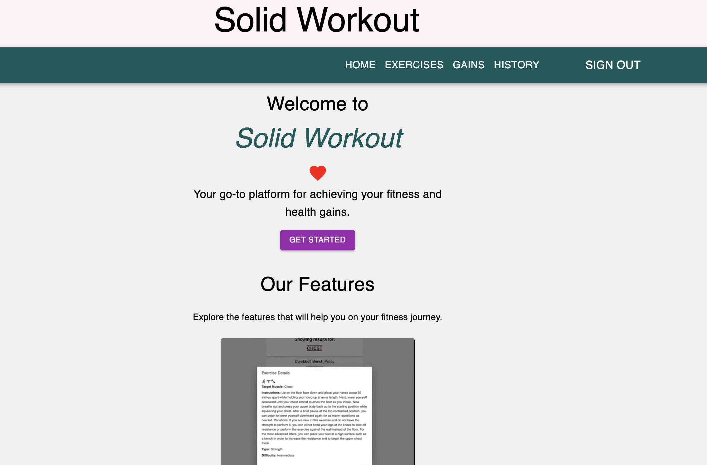
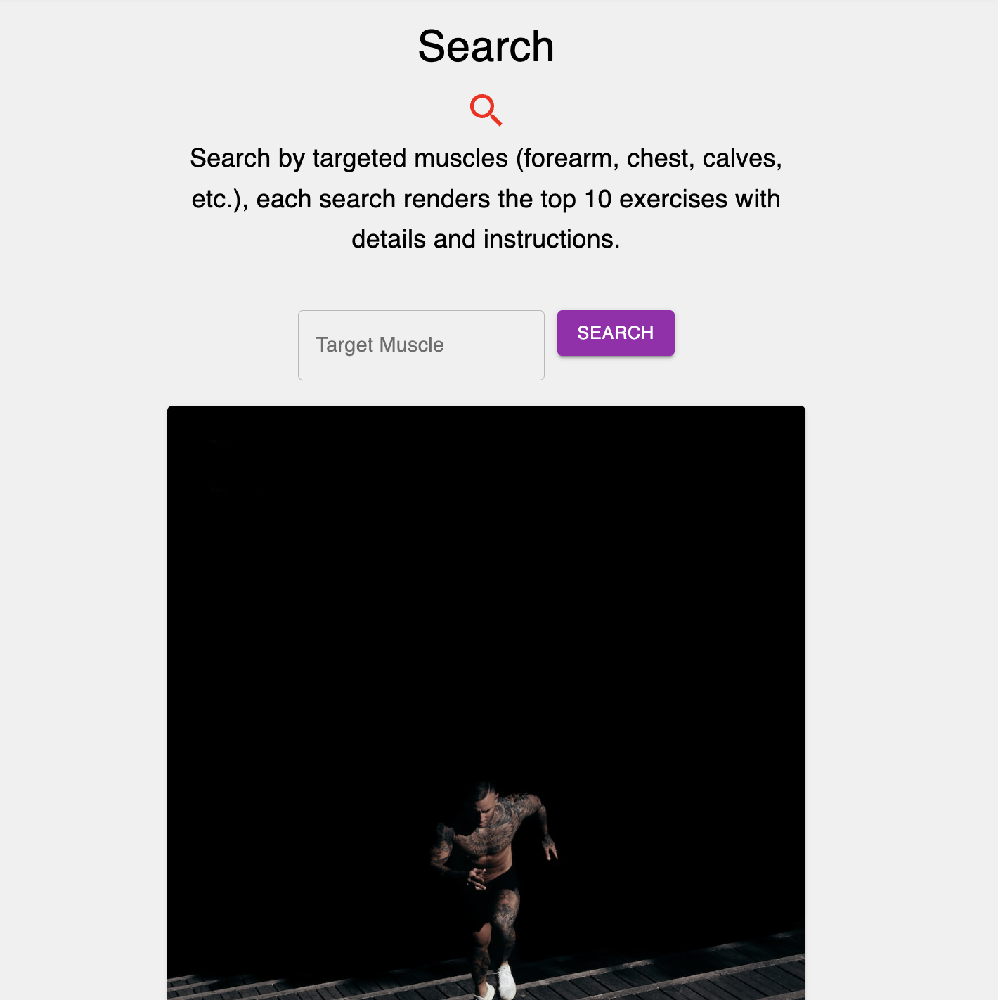
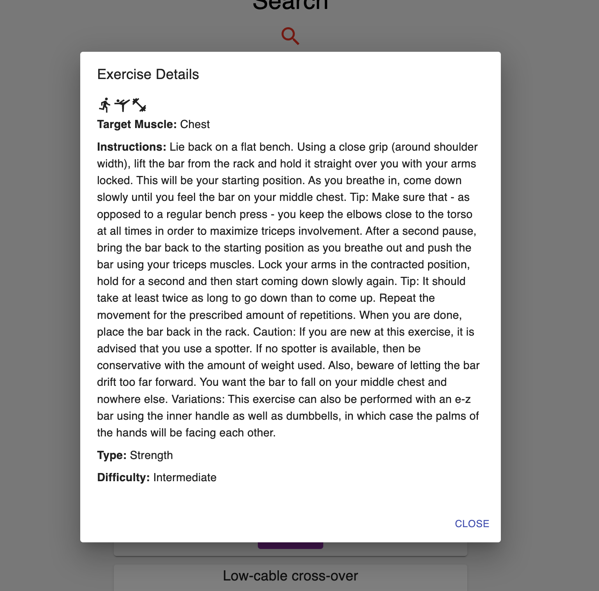

# Solid Workout Application

## Description

Full-Stack health/fitness application aimed at helping users track and achieve their fitness goals. Utilizes third-party API for additional features aimed at creating a safe workout environment. Deployed on Heroku using the MERN tech stack (MongoDB, Express, React, Node) 

Deployed on Heroku: [Click here](https://pacific-journey-41309-6c883acbaab3.herokuapp.com/) to explore the app.

Main Feature:
- Workout Log - Users can create a Solid Workout account and begin to document their workouts for later review, accountability or for progress tracking purposes.

Other Features:
- Exercises API - Used in the `exercises page` to make a search that renders 10 exercises along with workout instructions for each workout. 
- Unsplash API - Used in the `log in page` and the `gains page` to render fitness/health images. 

 
## Table of Contents

- [Technologies](#Technologies)
- [License](#License)
- [Credits](#Credits)
- [Contact](#Contact)
- [Future](#Future)

## Technologies

This application uses the following technologies:

- JavaScript
- React
- Node v18.12.1
- Express
- MongoDB
- Apollo Server
- GraphQL 
- Atlas (Cloud Database) 
- Material UI
- Third-Party APIs

## License

License: MIT License

## Credits

Jose Escoto, Software Engineer (Full Stack)

## Contact

For more questions please contact below:
Email: j.escoto14@gmail.com
GitHub: [escotoj](https://github.com/escotoj)

## Future Developments

- Add floating action button to be in every page once logged in as a component
- Add graph and charts to display 'past gains' in a more dynamic way
